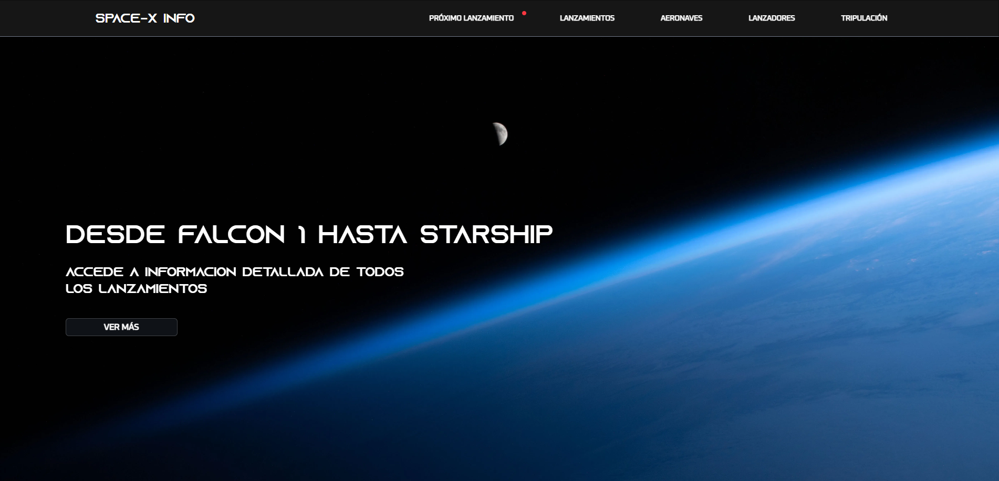
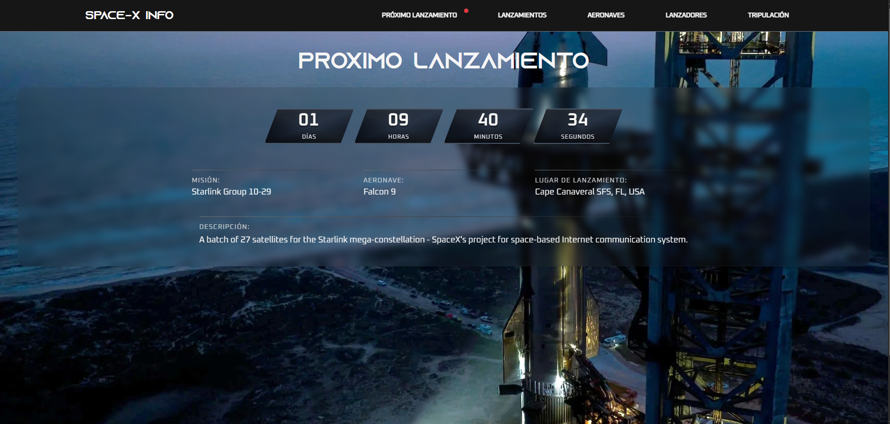
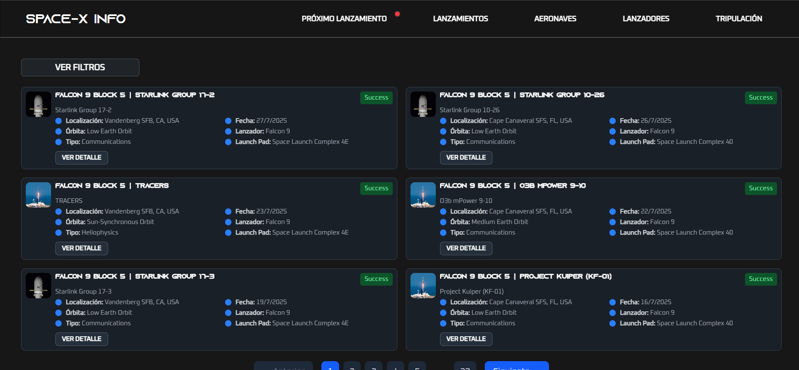

# spaceXINFO


## 📖 Descripción

**spaceXINFO** es una aplicación web de información general sobre proyectos de SpaceX. Recopila información oficial desde la API de TheSpaceDevs y presenta datos detallados sobre lanzamientos, aeronaves, lanzadores y tripulación de SpaceX de manera organizada y visual.

## ✨ Características

- **Próximo lanzamiento** con contador en tiempo real y detalles de misión
- **Lanzamientos** con vista resumida en cards y detalles completos
- **Aeronaves** con información técnica y especificaciones
- **Lanzadores** con datos técnicos detallados
- **Tripulación** con información de astronautas y misiones
- **Búsqueda y filtros** en secciones de tripulación y lanzamientos
- **Diseño responsive** optimizado para todos los dispositivos
- **Interfaz moderna** con tipografías personalizadas AZONIX y OXANIUM

## 🚀 Demo

**🔗 Demo en vivo:** [https://spacexinfo.adriancc.com/](https://spacexinfo.adriancc.com/)

## 📸 Capturas de pantalla

### Página Principal


### Próximo Lanzamiento


### Vista de Lanzamientos


### Detalles de Misión


## 🛠️ Tecnologías utilizadas

### Frontend
- **React:** 19.1.0
- **React DOM:** 19.1.0
- **HTML5, CSS3, JavaScript ES6+**

### Routing & Navigation
- **React Router DOM:** 7.6.3

### Estilos & UI
- **Tailwind CSS:** 4.1.11
- **Fuentes:** AZONIX, OXANIUM

### Animaciones
- **Framer Motion:** 12.23.6
- **GSAP:** 3.13.0

### Multimedia
- **React Lite YouTube Embed:** 2.5.1

### Desarrollo & Build
- **Vite:** 7.0.0

### API & Backend
- **API:** TheSpaceDevs API

### Deploy & Infrastructure
- **VPS Ubuntu con Virtual Host y DNS (Bind9)**

## 📋 Prerrequisitos

Antes de comenzar, asegúrate de tener instalado:

- [Node.js](https://nodejs.org/) (versión 16.0.0 o superior)
- [npm](https://www.npmjs.com/) 
- [Git](https://git-scm.com/)

## ⚙️ Instalación

1. **Clona el repositorio**
   ```bash
   git clone https://github.com/Kvr0th3c4t/spaceXINFO.git
   ```

2. **Navega al directorio del proyecto**
   ```bash
   cd spaceXINFO
   ```

3. **Instala las dependencias**
   ```bash
   npm install
   ```

4. **Configura las variables de entorno** (si aplica)
   ```bash
   cp .env.example .env
   # Edita .env con la configuración de la API
   ```

5. **Ejecuta la aplicación**
   ```bash
   npm run dev
   ```

6. **Abre tu navegador** y visita `http://localhost:5173`

## 🏗️ Estructura del proyecto

```
spaceXReact/
├── public/
├── src/
│   ├── assets/
│   │   ├── fonts/
│   │   ├── HomeImg/
│   │   ├── Icons/
│   │   ├── LaunchersImg/
│   │   ├── LaunchesImg/
│   │   └── SpacecraftsImg/
│   ├── components/
│   │   ├── layout/
│   │   │   ├── Launches/
│   │   │   ├── NextLaunch/
│   │   │   └── UI/
│   │   └── pages/
│   │       ├── Home.jsx
│   │       ├── NextLaunch.jsx
│   │       ├── Launches.jsx
│   │       ├── LaunchDetail.jsx
│   │       ├── Ships.jsx
│   │       ├── ShipDetail.jsx
│   │       ├── Launchers.jsx
│   │       ├── LaunchersDetail.jsx
│   │       ├── Tripulation.jsx
│   │       └── TripulationDetail.jsx
│   ├── constants/
│   ├── hooks/
│   │   ├── LaunchersHooks/
│   │   ├── LaunchesHooks/
│   │   ├── ShipsHooks/
│   │   └── TripulationHooks/
│   ├── routing/
│   │   └── AppRoutes.jsx
│   ├── App.jsx
│   └── main.jsx
├── package.json
├── vite.config.js
└── README.md
```

## 🔧 Scripts disponibles

```bash
npm run dev        # Ejecuta la app en modo desarrollo
npm run build      # Construye la app para producción
npm run preview    # Previsualiza la build de producción
npm run lint       # Ejecuta el linter (si está configurado)
```

## 🌐 API

Esta aplicación consume datos de:
- **[TheSpaceDevs API](https://thespacedevs.com/)**: API oficial para datos espaciales
- **Endpoints utilizados:** Definidos en `src/services/API.js`
  - Lanzamientos (próximos y pasados)
  - Información de aeronaves
  - Datos de lanzadores
  - Información de tripulación
  - Detalles específicos de misiones

## 📱 Responsive Design

La aplicación está optimizada para:
- 📱 **Mobile** (320px+)
- 📟 **Tablet** (768px+)  
- 💻 **Desktop** (1024px+)
- 🖥️ **Large Desktop** (1440px+)

## 🎨 Diseño

### Paleta de colores
- **Base:** Gama de neutrals de Tailwind CSS
- **Estilo:** Moderno y minimalista

### Tipografía
- **AZONIX**: Títulos y elementos destacados
- **OXANIUM**: Texto general y contenido

## 📂 Funcionalidades

### Implementadas ✅
- [x] Página de inicio con información general
- [x] Contador de próximo lanzamiento en tiempo real
- [x] Lista completa de lanzamientos con paginación
- [x] Vista detallada de cada lanzamiento
- [x] Catálogo de aeronaves SpaceX
- [x] Vista detallada de cada aeronave
- [x] Información de lanzadores
- [x] Vista detallada de lanzadores
- [x] Base de datos de tripulación
- [x] Perfiles detallados de astronautas
- [x] Sistema de búsqueda y filtros
- [x] Diseño responsive completo
- [x] Navegación intuitiva

## 🚀 Deployment

La aplicación está desplegada en un VPS Ubuntu personalizado:

### Configuración del servidor
- **OS:** Ubuntu Server
- **Web Server:** Apache2/Nginx con Virtual Host
- **DNS:** Bind9 para resolución de dominio
- **SSL:** Certificado configurado
- **Dominio:** spacexinfo.adriancc.com

### Para deploy local
1. Ejecuta `npm run build`
2. Los archivos se generan en la carpeta `dist/`
3. Sube el contenido a tu servidor web

## 🐛 Reportar problemas

Si encuentras algún bug o tienes sugerencias:

1. Verifica que no exista un issue similar
2. Crea un [nuevo issue](https://github.com/Kvr0th3c4t/spaceXINFO/issues)
3. Proporciona toda la información relevante

## 📝 Licencia

Este proyecto está bajo la Licencia MIT - mira el archivo [LICENSE](LICENSE) para más detalles.

## 👨‍💻 Autor

**Adrián Carmona (Kvur0th3c4t)**
- GitHub: [@Kvr0th3c4t](https://github.com/Kvr0th3c4t)
- LinkedIn: [Adrián Carmona](https://www.linkedin.com/in/adrián-carmonamad/)
- Email: adrianc.crim@hotmail.com

## 🙏 Agradecimientos

- [TheSpaceDevs](https://thespacedevs.com/) por proporcionar la API de datos espaciales
- [SpaceX](https://www.spacex.com/) por la inspiración y los increíbles proyectos espaciales
- [Tailwind CSS](https://tailwindcss.com/) por el framework de estilos
- [React](https://reactjs.org/) y [Vite](https://vitejs.dev/) por las herramientas de desarrollo

## 📊 Estado del proyecto


---

⭐️ **¡No olvides darle una estrella al proyecto si te gustó!** ⭐️

> **Nota:** Este es un proyecto personal desarrollado con fines educativos y de práctica. No está afiliado oficialmente con SpaceX.
